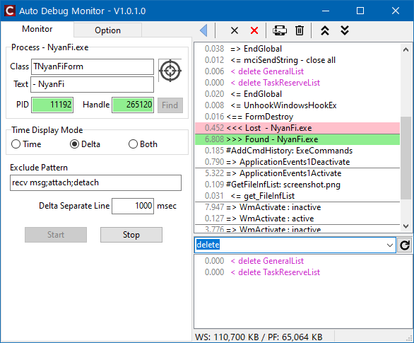

# Auto Debug Monior

## 概要

指定したクラス/テキストにマッチするウィンドウを見つけると、そのプロセスを監視してデバッグ出力(OutDebugStr)を表示します。  

## 使い方

Class と Text 欄を設定してください。Class は完全一致、Text は部分一致("/〜/" だと正規表現)です。  
Find ボタンを押すと、マッチするかテストできます。
表示されているウィンドウの情報をダーゲットアイコンで取得することも可能です。  

設定後に Start ボタンを押すと監視が始まり、マッチするウィンドウが見つかると、そのプロセスのデバッグ出力が表示されます。

## 開発環境

C++Builder 12 (BCC32C)
